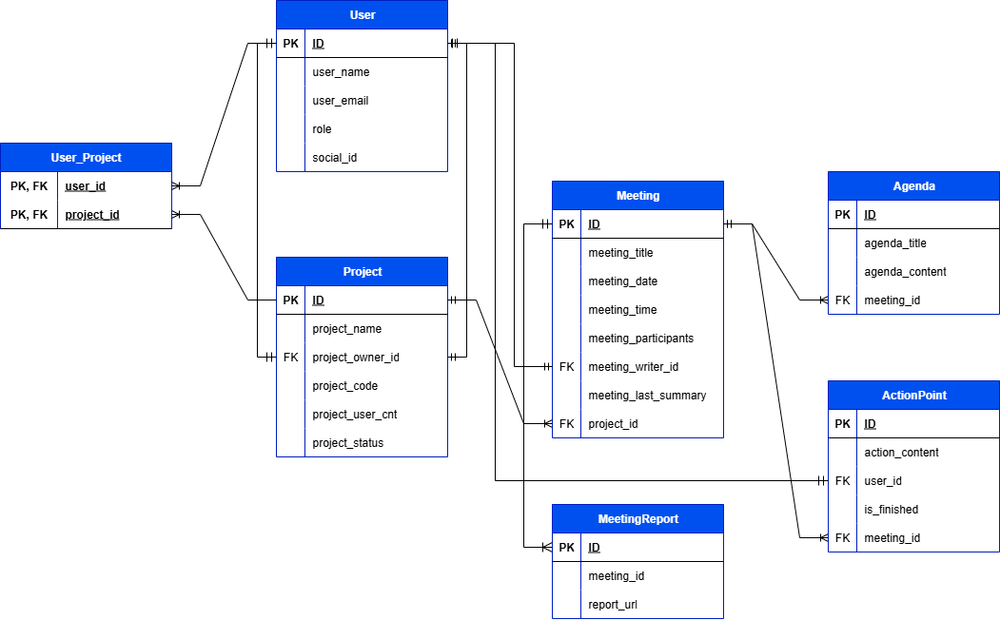

<div align="center">
  <a href="https://git.io/typing-svg">
    
  </a>

<div align="center">


<br />

<p>
  
  
</p>


<h3>Kick Off, In Progress, Complete!</h3>
<p>기록에서 실행까지, 당신의 회의를 완성합니다!</p>

</div>

---

## 📌 목차

- [📖 서비스 소개](#-서비스-소개)
- [🎯 기능 소개](#-기능-소개)
   - [🗂️ 프로젝트 및 회의록](#project-meeting)
   - [💪🏻 액션포인트](#action-point)
- [🚀 배포 링크](#-배포-링크)
- [🗺️ ERD](#-erd)
- [✏️ 커밋 메시지 컨벤션](#commit-convention)
- [🛠️ 기술 스택](#stack)
- [👥 팀원 소개](#team)

---

## 📖 서비스 소개

### “회의부터 실행계획까지 체계적으로 돕는 가이드 서비스, **Action Point**”

### 📝 무엇이 문제인가요?

- 😵‍💫 많은 대학생들이 회의 도중 논점을 벗어나고, 중요 안건을 빠뜨리는 일이 많습니다.
- 🤨 회의가 끝난 뒤, 본인이 무엇을 해야 하는지도 모르고 정리가 안 되는 상황이 발생합니다.

### 💡 저희의 해결 방식은 다음과 같습니다:

1. 회의 결과로 **액션포인트**를 명확하게 정리하고 담당자를 지정합니다.
2. **체크리스트와 달성률 시각화**를 통해 실행 과정을 관리하고 동기부여를 제공합니다.

---

## 🎯 기능 소개

<h3 id="project-meeting"> 🗂️ 프로젝트 및 회의록</h3>

- **프로젝트 생성 및 참여**  
  → 랜덤 코드 생성으로 간편하게 프로젝트 생성 및 참여
- **회의록 작성 기능**  
  → 3단계 회의록 작성으로 회의 과정을 체계적으로 정리
- **회의록 조회 기능**  
  → 프로젝트별로 회의록을 분류하여 쉽게 확인 가능

---

<h3 id="action-point"> 💪🏻 액션포인트</h3>

- **액션포인트 작성 기능**  
  → 회의 마지막 단계에서 담당자와 함께 구체적인 실행항목 등록
- **액션포인트 체크 기능**  
  → 대시보드 및 프로젝트 내에서 체크리스트 형태로 확인
- **달성도 확인 기능**  
  → 진행 상황을 그래프 및 응원 문구로 시각화

---

## 🚀 배포 링크

- **Frontend GitHub**  
  🔗 [https://github.com/Club-PARD/ActionPoint_FE](https://github.com/Club-PARD/ActionPoint_FE)

- **Backend GitHub**  
  🔗 [https://github.com/Club-PARD/ActionPoint_BE](https://github.com/Club-PARD/ActionPoint_BE)

- **Service 링크**  
  🌐 [https://action-point-fe-git-main-actionpoint.vercel.app](https://action-point-fe-git-main-actionpoint.vercel.app)

---

## 🗺️ ERD



---

<h2 id="commit-convention"> ✏️ 커밋 메시지 컨벤션</h2>

```
<행동> <세부 내용>

예시:
: add UserDto
: edit updateLastSummary in MeetingService
```

<h2 id="stack"> 기술 스택 </h2>
### 💻 Backend

>Language : Java    
>Library & Framework : Spring Boot    
>Database : MySQLDB    
>ORM : JPA     
>Deploy: Mysql(Storage)    
>Infrastructure : AWS EC2, AWS S3, AWS IAM, AWS Route 53

<!-- CONTACT -->
<h2 id="team"> 팀원 소개</h2>
